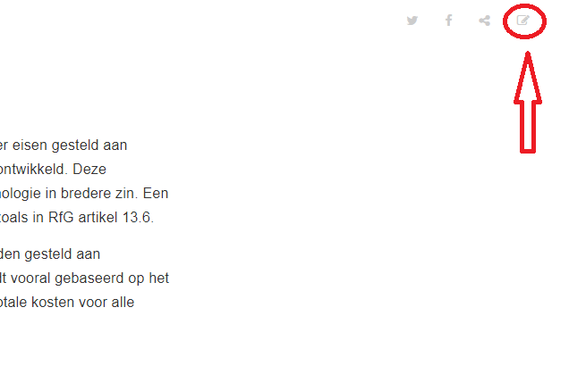

# Interfacespecificatie elektriciteit productie-eenheden RfG
Dit document dient om invulling te geven aan artikel 13, lid 6 van EU-verordening (EU) 2016/631 van 14 april 2016, naar de afkorting van de Engelse titel meestal aangeduid als "RfG". Het doel is een open samenwerking in de interfacespecificatie in de Nederlandse markt. Een eerste uitwerking is hierbij gepubliceerd voor een constructieve opbouw. Feedback is gewenst.

# Publicatie 
Dit document is opgezet met [Gitbook](https://toolchain.gitbook.com/). Dit document in HTML boekvorm wordt hier gepubliceerd:
https://netbeheernederland.gitbooks.io/interfacespecificatie-elektriciteit/content/

PDF, Mobi of Epub varianten zijn hier te vinden:
https://www.gitbook.com/book/netbeheernederland/interfacespecificatie-elektriciteit/details

# Aanvullingen
Iedereen is vrij om wijzigingsvoorstellen te doen (z.g. Pull-requests in Github). De governance bepaalt of deze geaccepteerd wordt.
Via de [HTML variant](https://netbeheernederland.gitbooks.io/interfacespecificatie-elektriciteit/content/) gaan wijzigen via het icoon rechtsbovenaan (herlaad de pagina eerst voordat dit werkt: crtl+F5):

Vervolgens kan je een wijzigingsverzoek (z.g. pull-request) sturen om je wijzigingen voor te leggen. Wil je meerdere bestanden bewerken? De referenties naar alle onderliggende bestanden staan in CONTRIBUTING.md. Hier kan je ook nieuwe pagina's aan toevoegen of verwijderen.

Meer informatie over het werken met Github:
* Github account aanmaken (gratis variant is voldoende): https://help.github.com/articles/signing-up-for-a-new-github-account/
* Bestanden/document wijzigen: https://help.github.com/articles/editing-files-in-another-user-s-repository/ 
* Bestanden uploaden (zoals plaatjes) kan ook: https://help.github.com/articles/adding-a-file-to-a-repository/
* Meer informatie over werken met Github kan je hier vinden: https://help.github.com/
* Gitbook mogelijkheden: https://toolchain.gitbook.com/syntax/markdown.html

# Issues melden
Kom je een fout rapporteren of wil je een discussiepunt/feedback inbrengen? Dit kan via Github issues.
https://help.github.com/articles/creating-an-issue/

# Assets
De bronnen zoals het Enterprise Architect (.eap) bestand en de powerpoint (.pptx) plaatjes staan in de map assets. 

# Status
De actieve ontwikkeling is on-hold. Vooruitlopend op verdere activiteiten vind de Alliander specifieke doorontwikkeling vind plaats op: 
https://github.com/Alliander/Interfacespecificatie-elektriciteit-productie-eenheden-RfG

# Branching strategie
Alle wijzigingen worden vooralsnog in de master branch geplaatst. 

# Governance
De governance vindt plaats binnen Netbeheer Nederland, projectgroep PIEC, Practische Implementatie Europese Codes. Gedelegeerden uit deze projectgroep zullen de verzoeken van wijzigingen verwerken en documenteren m.b.v. GitHub. Alle acties worden geregisteerd vastgelegd in GitHub.

# Licentie
Dit document wordt uitgegeven onder de MIT licentie.

# Vragen voor reviewers
Er vanuitgaande dat de EU richtlijn een gegeven is. Onderstaande vragen kunnen helpen om input te geven op dit document.
* Is dit de beste maatschappelijke invulling van de richtlijn? (Consumenten, Bedrijven, Netbeheers en andere stakeholders)
  * Bijvoorbeeld; Risico's (elektriciteits systeem stabiliteit/black-out) vs kosten (implementatie, interfaces en processen)
* Is de gekozen oplossing/richting voldoende eindgebruikers vriendelijk?
* Zijn er situaties waar niet aan gedacht is?
* Is de oplossing voldoende veilig/secure?
